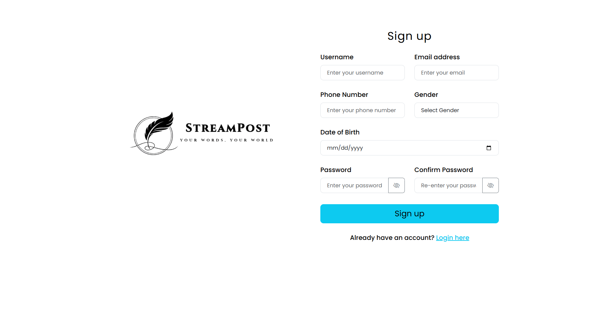
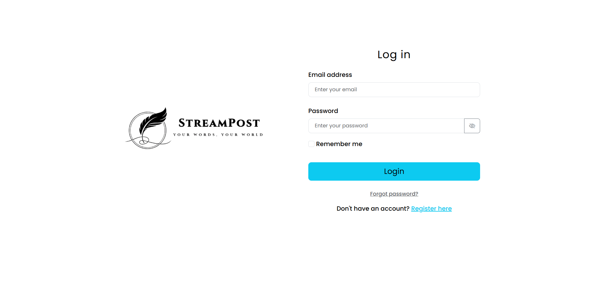
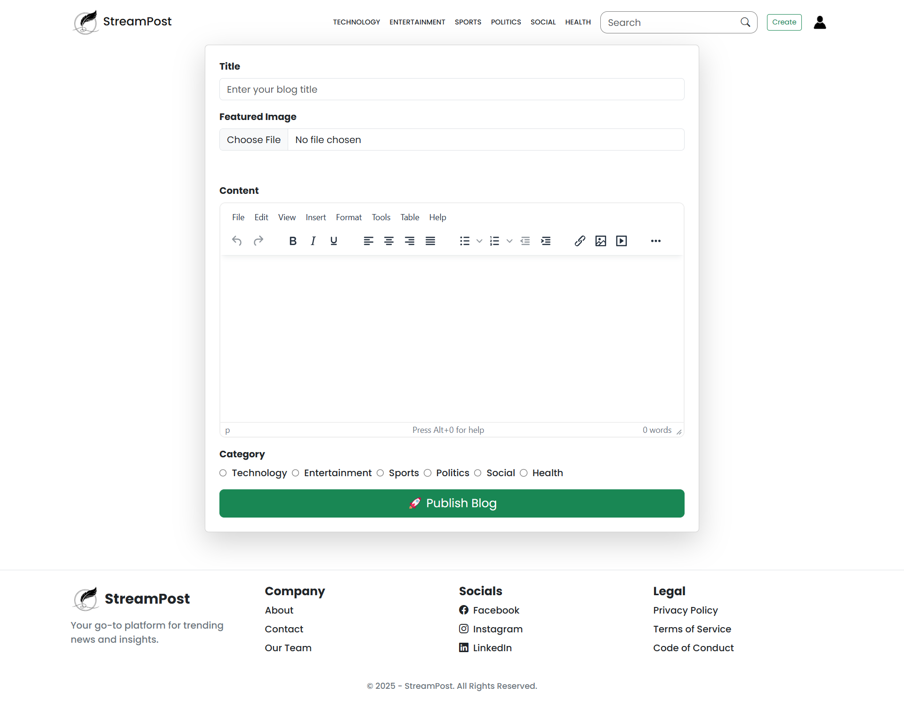
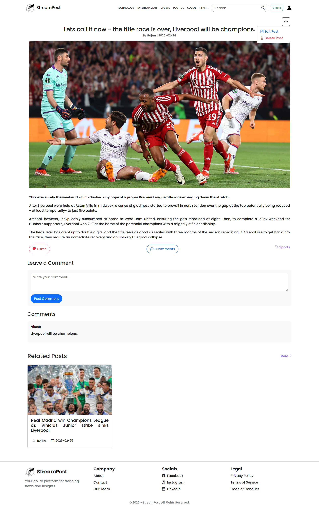
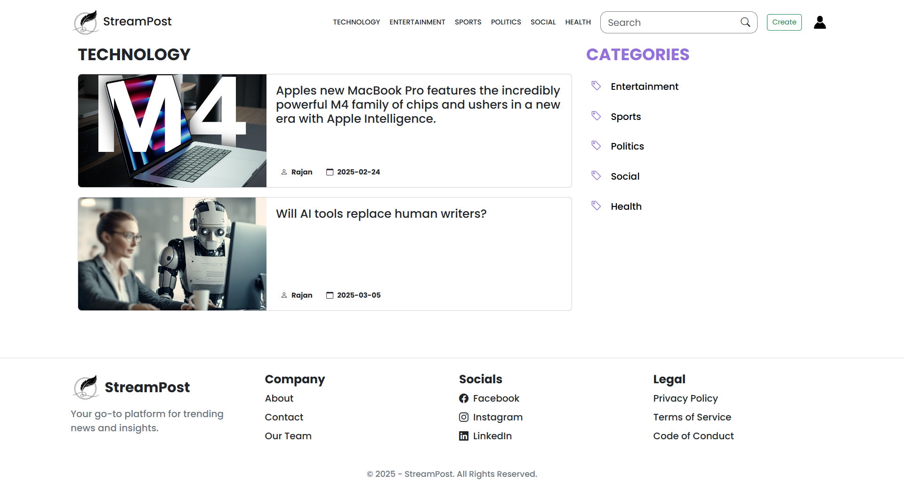
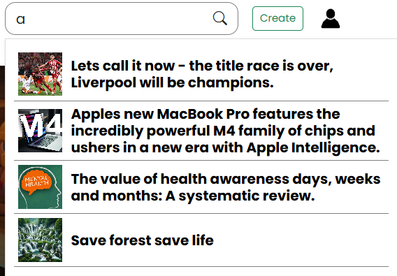
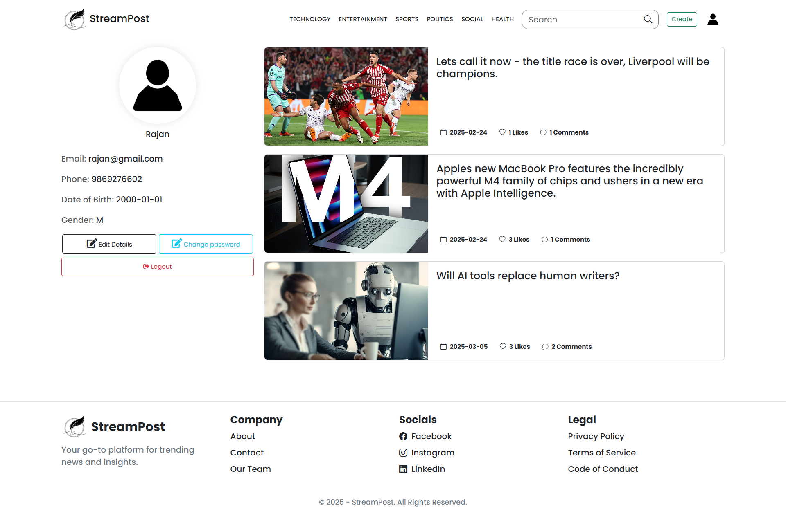

# StreamPost - Blog CMS

## Overview
StreamPost is a powerful Blog Content Management System (CMS) built using **ASP.NET Core MVC** and **Entity Framework Core**. It is designed to streamline blog creation, editing and deleting.
---

## Features

### Blog Post Management
- Create, edit, delete, and publish blog posts.
- Categorize posts using tags and categories.
- Add media (images) to enhance blog content.

### User Roles and Authentication
- Role-based access control:
  - **Author**: Create and manage personal blog posts.
  - **Reader**: View posts and add comments.
- Secure user registration, login, and logout functionality.

### Comment Moderation
- Readers can leave comments on blog posts.

### Dashboard
- Admin dashboard with insights into total posts.
- Author dashboard to track personal posts and comments.

### Tags and Categories
- Organize posts using categories.
- Filter posts by categories.

---

## Technologies Used

### Frontend
- **HTML/CSS/JavaScript**: For a clean and user-friendly interface.
- **Bootstrap**: Ensures consistent design.
- **Rich Text Editor**: Uses libraries like TinyMCE for content creation.

### Backend
- **ASP.NET Core MVC**: Core framework for building the application.
- **Entity Framework Core**: For database access and ORM.
- **ASP.NET Core Identity**: For user authentication and role management.
- **LINQ**: For efficient data querying.

### Database
- **SQL Server**: Primary database for application data storage.
- **EF Core Migrations**: To manage schema evolution.

### Tools
- **Visual Studio**: Development environment.
- **Git/GitHub**: Version control.

---

## Installation and Setup

1. **Clone the Repository**:
   ```bash
   git clone https://github.com/your-repo/ContentEdge.git
   cd StreamPost
   ```

2. **Configure Database**:
   - Update the connection string in `appsettings.json`:
     ```json
     {
       "ConnectionStrings": {
         "DefaultConnection": "Your_SQL_Server_Connection_String"
       }
     }
     ```

3. **Run EF Core Migrations**:
   ```bash
   dotnet ef database update
   ```

4. **Run the Application**:
   ```bash
   dotnet run
   ```
   - The application will be available at `http://localhost:5000`.

## Screenshots of StreamPost

**Signup Page**



**Login Page**



**Index Page**


**Create Page**



**Details**



**Categories Page**



**Search**



**UserProfile Page**


